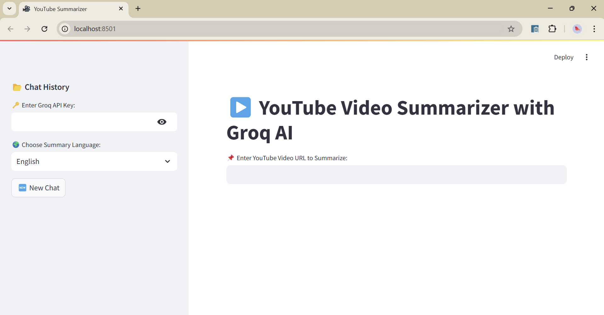

# 🎥 YouTube Video Summarizer with LLaMA & Groq API

🚀 **Summarize YouTube videos instantly using AI!**  
This project extracts **YouTube video transcripts** and generates a **structured summary** using **LLaMA & Groq API**. It features a **simple Streamlit UI**, supports **multiple languages**, and **saves chat history** for easy reference.

## 📌 Features
✅ Fetches **YouTube transcripts** automatically  
✅ Summarizes using **LLaMA** (Groq API)  
✅ Supports **multiple languages** for summaries  
✅ Saves **chat history** for easy reference  
✅ **Streamlit UI** for easy use  
✅ **Handles API errors** and user inputs gracefully  

---

## 🛠 Installation & Setup

### **1️⃣ Clone the Repository**
```bash
git clone https://github.com/yourusername/youtube-video-summarizer.git
cd youtube-video-summarizer
```

### **2️⃣ Install Dependencies**
```bash
pip install -r requirements.txt
```
### **3️⃣ Set up API Keys & Credentials**
You'll need API keys for Groq and YouTube Data API.
```bash
GROQ_API_KEY=your_groq_api_key
YOUTUBE_API_KEY=your_youtube_api_key
```
### **4️⃣ Run the App**
```bash
streamlit run app.py
```
Open your web browser and navigate to `http://localhost:8501` to access the Streamlit


---
## 🔑 API Key Setup

### 1️⃣ Groq API Key
- Sign up at Groq API
- Generate an API key
- Add it to your .env file as GROQ_API_KEY

### 2️⃣ YouTube Data API Key
- Go to Google Cloud Console
- Enable the YouTube Data API v3
- Generate an API key under "Credentials"
- Add it to your .env file as YOUTUBE_API_KEY

---
## 🚀 How to Use

1️⃣ **Enter a YouTube video URL**  
2️⃣ **Click Summarize**  
3️⃣ **Get a structured summary**  
4️⃣ **Choose language for translation**  
5️⃣ **Save & revisit past summaries**


---
## 📷 Demo Screenshot
  


---
## ⚠️ Limitations
- API Quota Limits: Groq & YouTube APIs may limit requests per day
- YouTube Captions: Some videos have no transcripts, so they can't be summarized
- Model Accuracy: AI-generated summaries may miss minor details

---
## 📜 License
This project is open-source under the MIT License.
You are free to modify, distribute, and use this project.

---
## ⭐ Support
If you like this project, give it a star ⭐ on GitHub!
Follow for more AI-based projects.

🔗 Connect with me on LinkedIn: https://www.linkedin.com/in/penta-srikanth/
📩 Email: srikanth.p126@gmail.com
